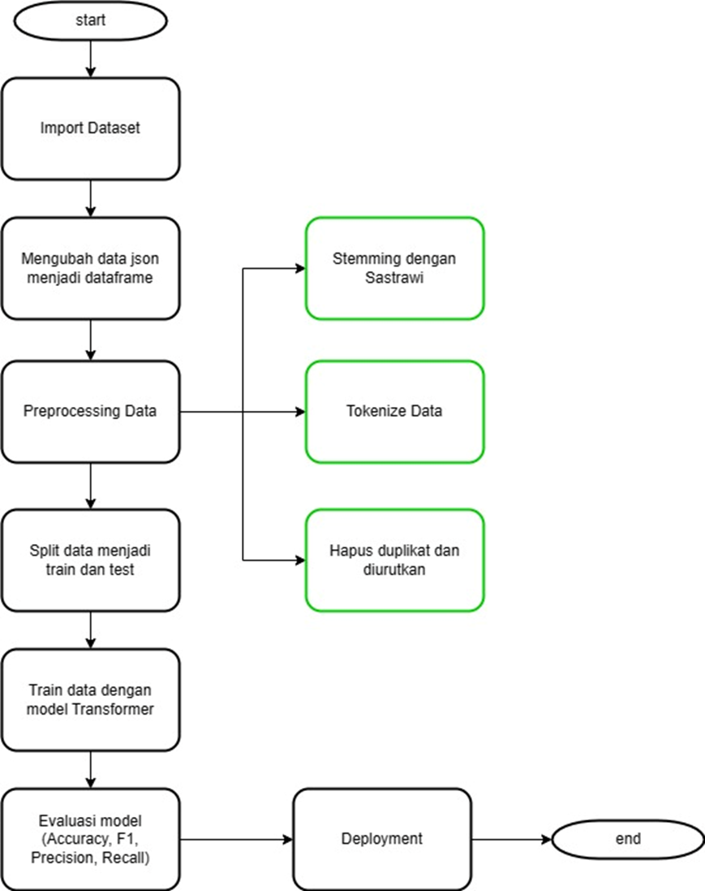
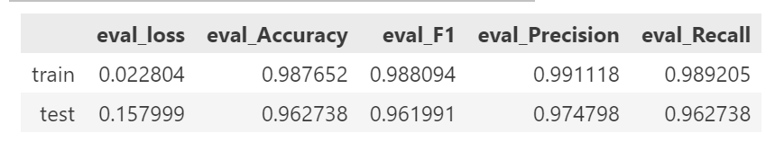

1. Dataset yang digunakan adalah data publik, beberapa dataset diambil dari kaggle yang kemudian ditranslate menjadi bahasa indonesia. Dataset dalam bentuk JSON dengan parameter ‘tag’, ‘patterns’, dan ‘responses’. Dataset berisi kompilasi pertanyaan dan jawaban seputar kesehatan mental. Berikut link dataset yang digunakan :

- https://www.kaggle.com/datasets/elvis23/mental-health-conversational-data
- https://www.kaggle.com/datasets/neelghoshal/therapist-patient-conversation-dataset/data

2.  Banyak masyarakat yang tidak memiliki akses terhadap layanan kesehatan mental. Buruknya akses terhadap layanan kesehatan mental disebabkan oleh beberapa faktor seperti terbatasnya ketersediaan layanan kesehatan mental, mahalnya biaya layanan kesehatan mental. Tujuan yang ingin dicapai dalam penelitian ini adalah untuk meningkatkan kesejahteraan mental masyarakat yang tidak terjangkau oleh layanan kesehatan mental

    

3.  Dari bagan diatas menunjukkan model yang digunakan adalah transformer (BERT). Tahap pertama dimulai dengan import dataset berbentuk JSON, yang kemudian diubah menjadi pandas dataframe. Kemudian preprocessing data dengan stemming menggunakan sastrawi, hapus duplikasi data dan diurutkan, lalu tokenize data dengan BertTokenizer dari Package Transformers. Lanjut split data menjadi data train dan test. Kemudian train menggunakan model di training. Setelah selesai di training kemudian di evaluasi untuk mendapatkan nilai Accuracy, F1, Precision, dan Recall. Langkah terkahir yaitu deployment agar bisa digunakan untuk berinteraksi antara chatbot dan user.

4. Performance model yang digunakan adalah BERT. Pada data train memiliki nilai akurasi sebesar 0.98, nilai F1 sebesar 0.98, nilai precision sebesar 0.99, dan nilai recall sebesar 0.98.
   Pada data test, memiliki nilai akurasi sebesar 0.96, nilai F1 sebesar 0.96, nilai precision sebesar 0.97, dan nilai recall sebesar 0.96. Dari hasil tersebut dapat disimpulkan bahwa model yang digunakan memiliki performa yang baik.
